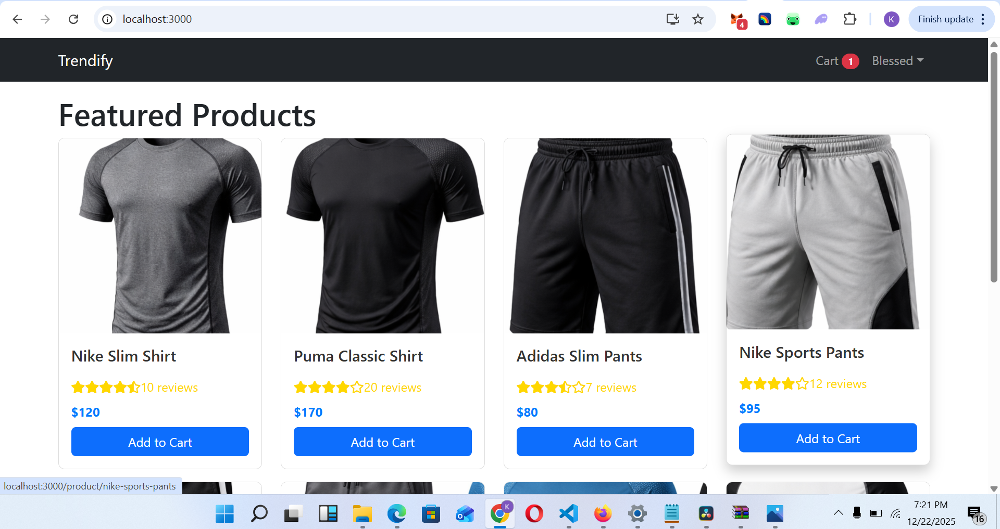
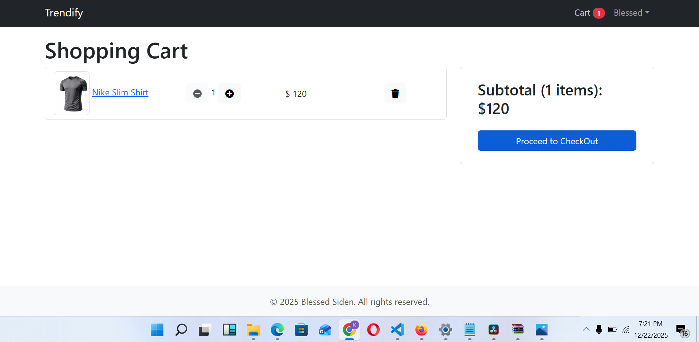
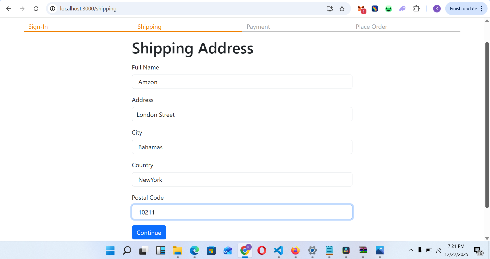
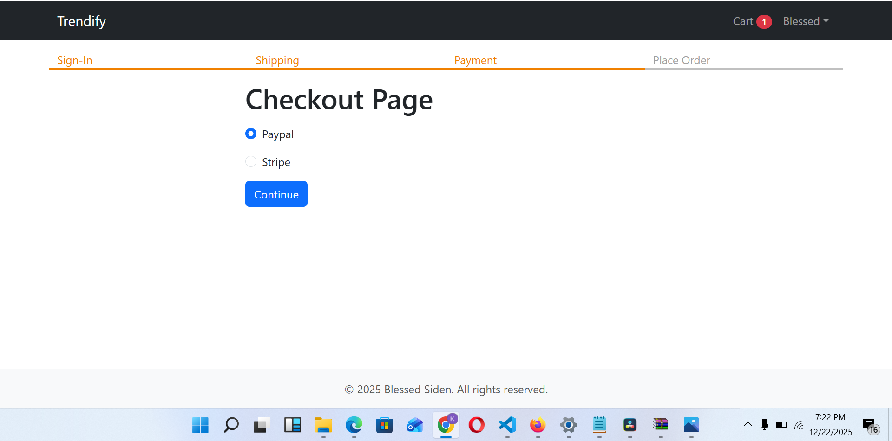
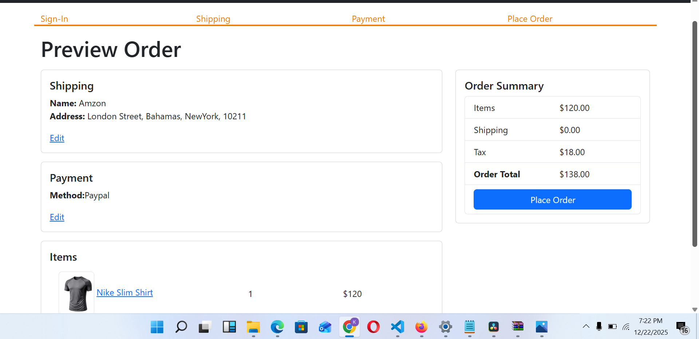
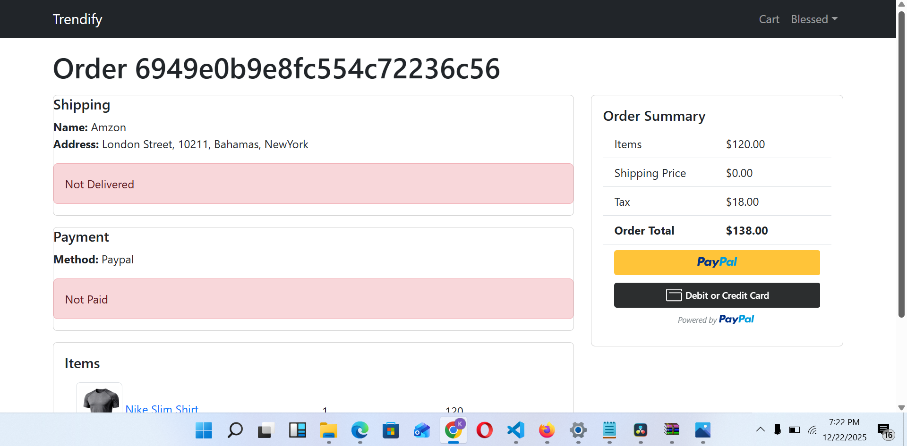

# Ecommerce-App

A full-stack e-commerce application built with **React**, **Node.js**, **Express**, **MongoDB**, and **Bootstrap**.  
Users can browse products, add them to cart, and securely checkout using **PayPal** or **Stripe**. Admins can manage products and users.

---

## 📸 Screenshots

**Home Page**  



**Proceed to Checkout Page**  


**Shipping Address Page**  


**Checkout Page**  


**Preview Order Page**  


**Order Page**  



---

## 🚀 Features

- Browse products by category
- Product ratings and reviews
- Add to Cart functionality
- Stock management
- User authentication & admin roles
- Seed script to populate initial products and users
- Responsive design with Bootstrap
- Checkout with **PayPal** and **Stripe**

---

## 🛠 Tech Stack

- **Frontend:** React, React Router, Bootstrap  
- **Backend:** Node.js, Express.js, MongoDB, Mongoose  
- **Authentication:** JWT  
- **Payment:** PayPal and Stripe

---

## 📦 Folder Structure

```
Ecommerce-App/
│
├─ backend/            # Express API & DB
│   ├─ models/
│   ├─ routes/
│   ├─ seed.js         # Script to populate initial data
│   └─ data.js
│
├─ frontend/           # React app
│   ├─ public/
│   ├─ src/
│   │   ├─ components/
│   │   ├─ pages/
│   │   └─ styles/
│   └─ package.json
│
├─ .gitignore
├─ README.md           # Project documentation
└─ package.json
```

---

## ⚡ Environment Variables

Create a `.env` file in the **backend** directory with the following:

```env
MONGO_URI=<YOUR_MONGODB_URI>
JWT_SECRET=<YOUR_JWT_SECRET>
PAYPAL_CLIENT_ID=<YOUR_PAYPAL_CLIENT_ID>
STRIPE_SECRET_KEY=<YOUR_STRIPE_SECRET_KEY>
```

Create a `.env` file in the **frontend** directory with the following:

```env
REACT_APP_API_URL=http://localhost:5000
```


> Replace `sk_test_your_stripe_secret_key` with your Stripe test secret key.

---

## ⚡ Getting Started

### 1️⃣ Clone the repository
```bash
git clone https://github.com/BlessedSiden1234/Ecommerce-App.git
cd Ecommerce-App
```

### 2️⃣ Install backend dependencies
```bash
cd backend
npm install
```

### 3️⃣ Seed the database
> ⚠️ You must seed the database first to populate users and products
```bash
node seed.js
```

### 4️⃣ Start the backend server
```bash
npm run dev
```
Backend runs on `http://localhost:5000` and proxies requests to the frontend.

### 5️⃣ Install frontend dependencies
Open a new terminal:
```bash
cd frontend
npm install
```

### 6️⃣ Start the frontend
```bash
npm start
```
Frontend runs on `http://localhost:3000` and communicates with the backend via proxy.

---

## 🔧 Notes

- **Proxy setup:** The frontend `package.json` uses `"proxy": "http://localhost:5000"` to forward API requests.  
- **Admin access:** Use the seeded admin user:
  - Email: `kennethsiden@gmail.com`
  - Password: `123456`  
- **Payments:** Checkout supports **PayPal sandbox** and **Stripe test payments** for demo purposes.

---

## 📚 Future Improvements

- Full PayPal/Stripe production integration
- Order history and tracking
- Product search and filtering
- Admin dashboard with product/user management
- User reviews & ratings submission

---

## 🎯 License

MIT License © 2025 Blessed Siden
